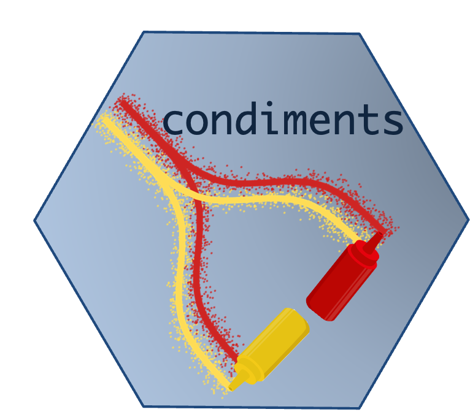

# condimentsPaper

This repository is made to host a reproducible version of the condiments paper. Some of the functions can take a long time to 
run and we have therefore saved intermediary objects. However, they can be entirely recreated by running all code blocks in the appropriate vignette. 

You can access a preprint of the paper here and the condiments package is available on github [here](https://github.com/HectorRDB/condiments).

You can follow along the vignettes [here](https://hectorrdb.github.io/condimentsPaper/articles/).

There are 5 vignettes that follow along the paper

# Examples

[The first vignette](https://hectorrdb.github.io/condimentsPaper//articles/Examples.html) is a list of all examples used in Figure 1 and S1 of the manuscript

# Simulation

[The second vignette](https://hectorrdb.github.iocondimentsPaper/Simulations.html) contains the code to run all simulations. It is not run here but instead loads the data from this package to generate the plots from Figure 2, Figure S2-S5. 

# TGFB case study

[The third vignette](https://hectorrdb.github.io/condimentsPaper/articles/TGFB.html) contains all the code to download the first dataset. It then loads the dataset from this package and conducts the analysis to generate Figures 3 and 4.

# Fibrosis case study

[The fourth vignette](https://hectorrdb.github.io/condimentsPaper/articles/Fibrosis.html) contains all the code to download the second dataset. It then loads the dataset from this package and conducts the analysis to generate Figures 5 and S6-7.

# TCDD case study

[The fifth vignette](https://hectorrdb.github.io/condimentsPaper/articles/TCDD.html) contains all the code to download the second dataset. It then loads the dataset from this package and conducts the analysis to generate  Figures S8-9.

# KRAS case study

[The sixth and final vignette](https://hectorrdb.github.io/condimentsPaper/articles/KRAS.html) contains all the code to download the third dataset. It then loads the dataset from this package and conducts the analysis to generate Figures S10-12.
